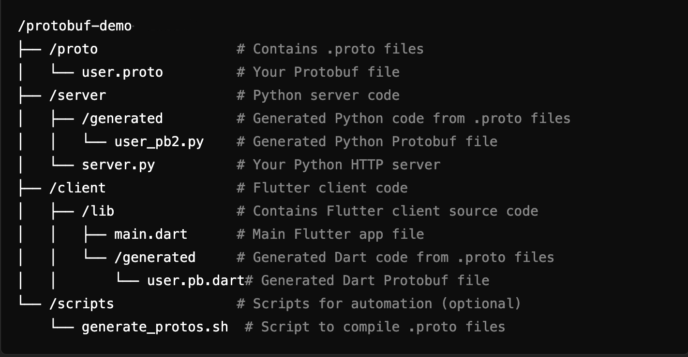

# Protobuf Demo

## Overview

This project demonstrates the usage of Protocol Buffers (Protobuf) for data serialization in a simple Python-based server. It showcases how to build a server-client architecture using Protobuf without relying on gRPC, focusing on efficient data exchange between a Python server and a Flutter client app.
## Features

- Efficient Data Serialization: Uses Protobuf to serialize and deserialize structured data, reducing message size compared to JSON.  
- HTTP-based Communication: Implements an HTTP server to facilitate data exchange, offering flexibility where gRPC is not necessary.  
- Flutter Client Integration: A cross-platform Flutter client app interacts with the server, showcasing Protobuf's multi-platform capabilities.  
- Lightweight and Simple: A streamlined, easy-to-understand implementation that demonstrates the core concepts of using Protobuf in non-gRPC environments.  

## Components
Python HTTP Server:  
Serves as the backend, sending and receiving Protobuf-encoded data via HTTP requests.  

Flutter Client App:   
A mobile application that communicates with the server to exchange Protobuf data over HTTP.  


## Project Structure


## Prerequisites

- Python 3.x
- pip (Python package manager)
- Flutter (for the client application)

## Getting Started

1. Clone the repository:

   ```bash
   git clone https://github.com/rajivmanivannan/protobuf-demo.git
   cd protobuf-demo-server
   ```
2. Create a virtual environment:

   ```bash
   python -m venv venv
   ```
3. Activate the virtual environment:

   ```bash
   source venv/bin/activate
   ```
4. Install the dependencies:

   ```bash
   pip install -r requirements.txt
   ```
5. Verify the installation:

   ```bash
   pip freeze
   ```

### Protobuf Code Generation

To generate both Python and Dart files for the .proto definitions:

```sh
bash scripts/generate_protos.sh  
```

### Running the Server Application

To run the Python application:

```sh
python server/server.py 
```

### Serializing the Protobuf Request
To serialize the Protobuf request:

 ```sh
python create_user_request.py
```

### Sending the Request with cURL
Use the following curl command to send the request:

 ```sh
curl -X POST 127.0.0.1:5000/get_user \
     -H "Content-Type: application/x-protobuf" \
     --data-binary @user_request.bin \
     --output user_response.bin
```

### Deserializing the Protobuf Response
To deserialize the Protobuf response:

 ```sh
python deserialize_response.py
```
### Debugging Wire Format (Binary Data)
The Protobuf compiler (protoc) has a --decode & --decode_raw options that lets you decode binary messages back into human-readable form

 ```sh
protoc --decode_raw < binary_data_file  

# Decodes the binary data using the .proto definition
protoc --decode=User proto/user.proto < binary_data.bin
```

### Running the client Application  
Flutter project is under ```/client``` directory. You can open and run the flutter app with your choice of IDE like Android Studio or VSCode etc.,
  
or  

```sh
cd client

# To install dependencies
flutter pub get 

# To run the app
flutter run
```


## License
This project is licensed under the MIT License

## Acknowledgments
Special thanks to the Protocol Buffers team for their excellent work.
Thanks to the Flask community for providing a lightweight web framework.
